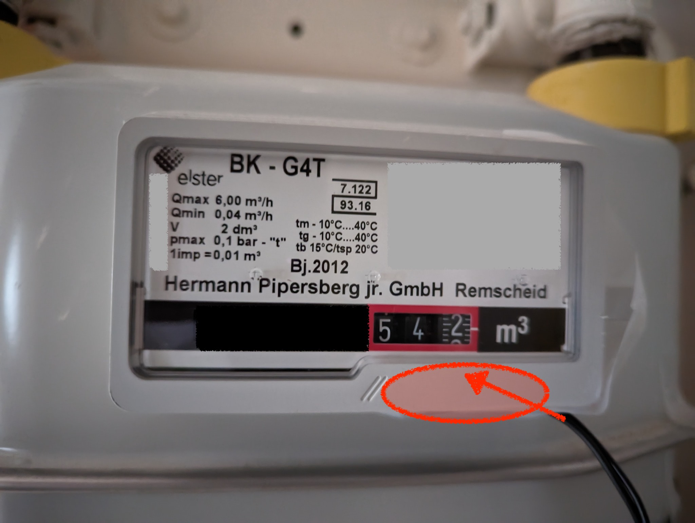

# Prometheus Exporter for a Gas Meter using Arduino/ESP 8266

Many (not all) gas meters have a small magnet attached to the
rightmost digit. When putting a reed contact near that digit,
it closes for a short time for every full rotation of the last
digit.

You can buy these reed contacts ready-made with a case that fits
your gas meter, like e.g.
[ELV ES-GAS-2](https://de.elv.com/elv-energy-sensor-gas-2-es-gas-2-156782)
or, if you want to save some bucks, use a cheap contact and just
duct-tape it in place.

This sketch monitors a digital pin's state, and increments
a counter for each falling edge. The counter is exposed via a web
server as a prometheus metrics page at `/metrics`.

While this sketch can count any type of device that emits counting
pulses,  I use this to monitor gas consumption, with a reed contact
attached to my gas meter that sends a pulse every 0.01 cubic meters.

## Prerequisites

- A compatible Gas Meter
- ESP 8266 Microcontroller, e.g. WEMOS D1 Mini
- Reed contact attached to VCC and GPIO 5
  (change `PULSE_PIN` if you prefer another GPIO)
- Arduino IDE with ESP 8266 support installed (use Tools/Board/Board Manager)

## How to use it

- Check out the repository
- Copy/rename [wifisettings.h.template](wifisettings.h.template) to `wifisettings.h`
- Enter your WIFI credentials
- Upload using Arduino IDE
